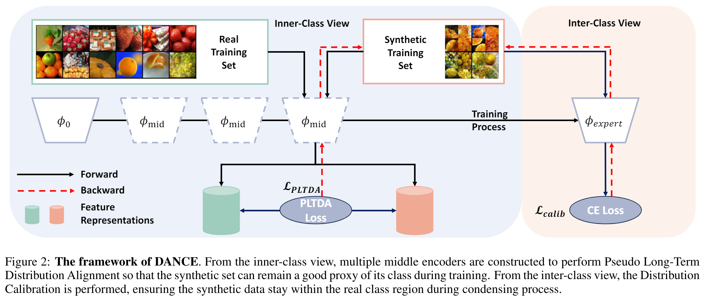
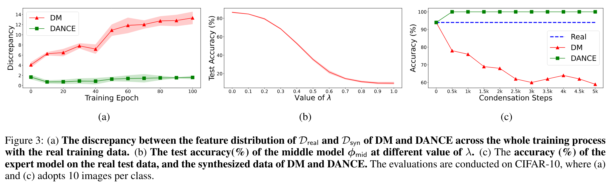
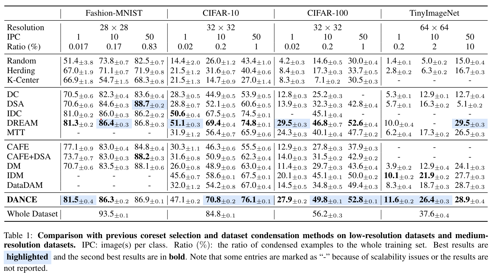
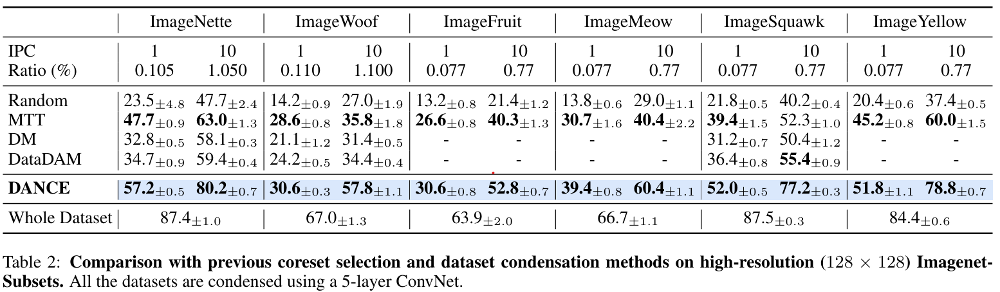
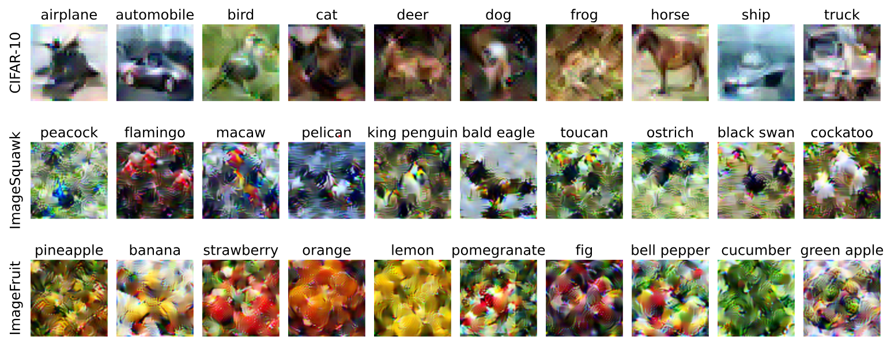

# [IJCAI 2024] DANCE: Dual-View Distribution Alignment for Dataset Condensation

## [Paper](https://arxiv.org/abs/2406.01063)
# Abstract
Dataset condensation addresses the problem of data burden by learning a small synthetic training set that preserves essential knowledge from the larger real training set. To date, the state-of-the-art (SOTA) results are often yielded by optimization-oriented methods, but their inefficiency hinders their application to realistic datasets. On the other hand, the Distribution-Matching (DM) methods show remarkable efficiency but sub-optimal results compared to optimization-oriented methods. In this paper, we reveal the limitations of current DM-based methods from the inner-class and inter-class views, i.e., Persistent Training and Distribution Shift. To address these problems, we propose a new DM-based method named Dual-view distribution AligNment for dataset CondEnsation (DANCE), which exploits a few pre-trained models to improve DM from both inner-class and inter-class views. Specifically, from the inner-class view, we construct multiple "middle encoders" to perform pseudo long-term distribution alignment, making the condensed set a good proxy of the real one during the whole training process; while from the inter-class view, we use the expert models to perform distribution calibration, ensuring the synthetic data remains in the real class region during condensing. Experiments demonstrate the proposed method achieves a SOTA performance while maintaining comparable efficiency with the original DM across various scenarios.

# Main Results



# Visualization of Distilled Images

For more visualization results, please refer to the website of DANCE [Click Here](https://hansong-zhang.github.io/DANCE/).
## Getting Started
1. Change the data paths and results paths in arguments/reproduce_xxxx.py
2. Perform the pre-training process
```
python pretrain.py -d cifar10 --reproduce
```
This will train multiple models from scratch and save their initial and ultimate state of dict.
3. Perform the condensation process using DANCE
```
python DANCE.py -d cifar10 --ipc 50 --factor 2 --reproduce
```

## Acknowledgement
Our code is built upon [IDC](https://github.com/snu-mllab/efficient-dataset-condensation)
## Citation
If you find our code useful for your research, please cite our paper.
```
@inproceedings{zhang2024dance,
  title={{DANCE}: Dual-View Distribution Alignment for Dataset Condensation},
  author={Zhang, Hansong and Li, Shikun and Lin, Fanzhao and Wang, Weiping and Qian, Zhenxing and Ge, Shiming},
  booktitle={Proceedings of the International Joint Conference on Artificial Intelligence (IJCAI)},
  year={2024}
}
```


